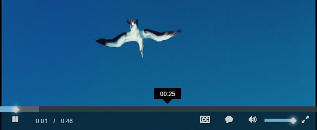
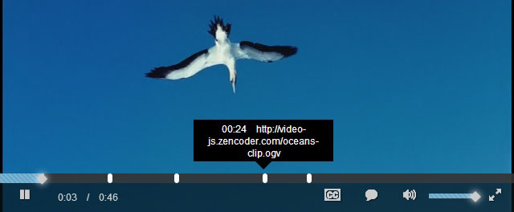

# Video.js Progress

This is a plugin based on [jQuery](http://jquery.com/) for [Video.js](https://github.com/videojs/video.js) to make progress bar stronger.

## Features

1.  Tooltip

    

2.  Timepoint

    

## Dependencies

* jQuery 1.8.3
* Video.js 4.7.3

## Installation

    <link href="videojs-progress.css" rel="stylesheet">
    
    

## Usage

    
